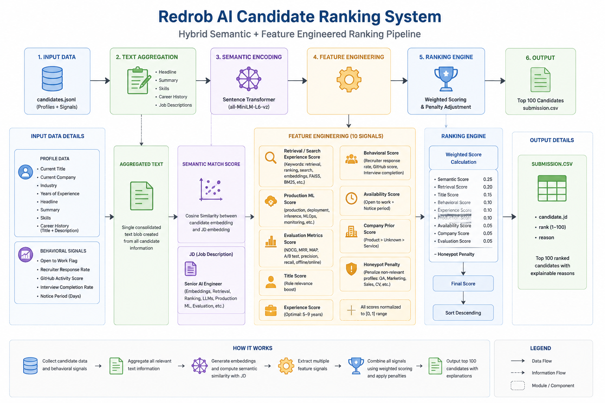

# Redrob AI Candidate Ranking System

## Problem Statement

Build an AI system to rank candidates for a Senior AI Engineer role using candidate profiles, career history, skills, and behavioral signals.

## Approach

I designed a hybrid candidate ranking system combining:

- Semantic similarity using Sentence Transformers
- Feature engineered ranking signals
- Behavioral scoring
- Company priors
- Availability scoring
- Honeypot filtering

## Architecture Diagram



---

## Feature Engineering

Features used:

1. Semantic Match Score
2. Retrieval/Search Experience Score
3. Production ML Score
4. Evaluation Metrics Score
5. Title Score
6. Experience Score
7. Behavioral Score
8. Availability Score
9. Company Prior Score
10. Honeypot Penalty

---

## Ranking Formula

Final Score =

0.25 × Semantic Score +  
0.20 × Retrieval Score +  
0.15 × Title Score +  
0.10 × Behavioral Score +  
0.10 × Experience Score +  
0.10 × Production Score +  
0.05 × Availability Score +  
0.05 × Company Score +  
0.05 × Evaluation Score − Honeypot Penalty

---

## Pipeline

```text
Candidate Data
      ↓
Text Aggregation
      ↓
Sentence Transformer Embeddings
      ↓
Feature Engineering
      ├── Retrieval Score
      ├── Production ML Score
      ├── Evaluation Score
      ├── Behavioral Score
      ├── Experience Score
      ├── Company Prior Score
      ├── Availability Score
      └── Honeypot Detection
      ↓
Weighted Ranking Engine
      ↓
Top Ranked Candidates
      ↓
Submission CSV
```

---

## Tech Stack

- Python
- Sentence Transformers (`all-MiniLM-L6-v2`)
- Scikit-learn
- Pandas
- JSON
- Cosine Similarity

---

## Project Structure


redrob-ai-ranker/

├── src/
│   ├── ranker_v2.py
│   ├── ranker_v3.py
│   ├── ranker_v4.py
│   ├── ranker_v5.py
│   ├── ranker_v6.py
│   ├── generate_submission.py
│   └── inspect_candidate.py
│
├── outputs/
│   ├── top100_v6.csv
│   └── submission.csv
│
├── assets/
│   └── architecture.png
│
└── README.md
```

---

## Experiments

Experiments performed:

- Baseline semantic matching
- Added retrieval signal engineering
- Added production ML signals
- Added evaluation metrics scoring
- Added company priors
- Added honeypot penalties

Final selected version: **V6**

---

## Model Evolution

**V2**
- Baseline semantic similarity
- Title matching

**V3**
- Added domain scoring
- Added behavioral signals

**V4**
- Added retrieval/search experience features

**V5**
- Added production ML and evaluation metrics

**V6**
- Added company priors
- Added honeypot filtering

---

## Results

Generated top 100 ranked candidates with explainable reasoning.

The final system successfully:

- Ranked candidates using semantic understanding
- Prioritized retrieval/search experience
- Identified production ML expertise
- Rewarded evaluation knowledge
- Reduced false positives using penalties

---

## Key Design Decisions

- Used semantic embeddings instead of exact keyword matching to capture contextual relevance.
- Added retrieval and ranking signals because the JD strongly emphasized search systems.
- Added production ML signals to prioritize deployed systems experience.
- Added evaluation metric signals (NDCG, MRR, A/B testing) because evaluation quality often determines ranking system success.
- Added honeypot penalties to avoid unrelated profiles such as QA, Cloud, and non-AI candidates.

---

## Future Improvements

- Cross-encoder reranking
- Learning-to-rank models
- Dynamic feature weighting
- Online feedback loop
- Recruiter feedback based model updates

---

## How To Run

Install dependencies:
pip install pandas
pip install scikit-learn
pip install sentence-transformers


Run ranking:


python src/ranker_v6.py


Generate submission:


python src/generate_submission.py


Inspect candidates:


python src/inspect_candidate.py
  